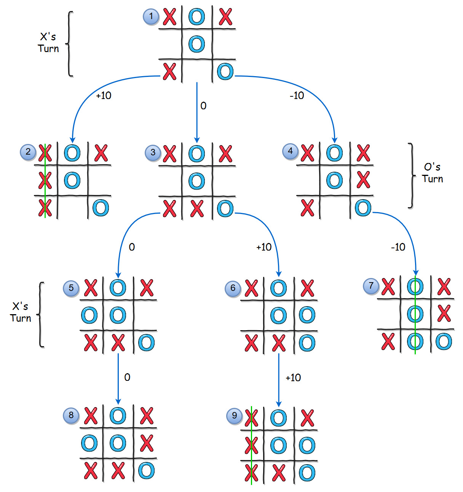
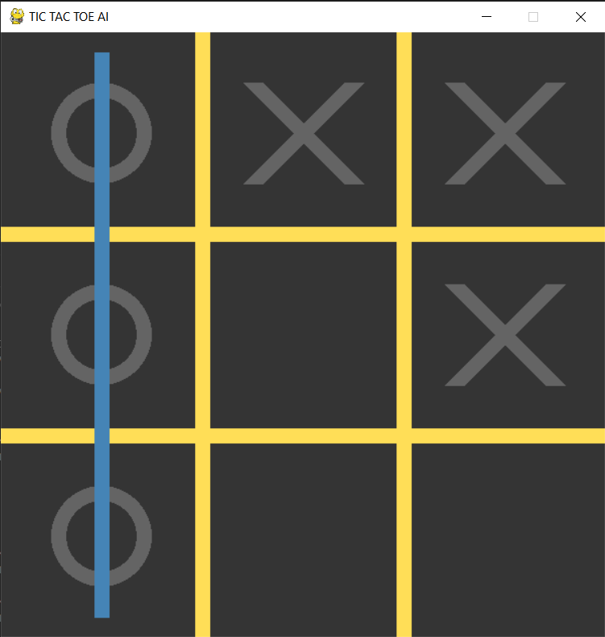

# Tic Tac Toe AI

## Project Overview
This project is a Python-based **Tic Tac Toe game** with an AI opponent, implemented using the **pygame** library. The game allows the player to play against the computer, with the AI using the Minimax algorithm to make optimal moves. The project is designed for educational purposes and demonstrates key concepts in game development, artificial intelligence, and Python programming.

---

## Features
- **Mode of Play**:
  - Player vs AI
- **AI Intelligence**:
  - The AI uses the **Minimax algorithm** to evaluate the optimal moves. 

  - Adjustable difficulty: random moves for easy mode and Minimax for hard mode.
- **Winning Line Visualization**:
  - When a player wins, the game highlights the winning line (horizontal, vertical, or diagonal).
- **Reset Functionality**:
  - Players can restart the game at any time by pressing the `R` key.

---

## How to Play
1. **Start the Game**:
   - Run the Python script using `python mini_project.py`.
2. **Player Moves**:
   - Click on any square to place your marker X.
   - Player 1 (human) always starts.
3. **AI Moves**:
   - The AI will automatically make its move after the player.
4. **Winning**:
   - The game ends when either player has three markers in a row, column, or diagonal.
   - The winning line is highlighted on the board.
5. **Draw**:
   - If the board is full and no player has won, the game ends in a draw.
6. **Restart**:
   - Press `R` to reset the game and start over.

---

## Requirements
- **Python 3.8 or higher**
- **pygame library**:
  Install pygame using the following command:
  ```bash
  pip install pygame
  ```
- **numpy library**:
  Install numpy using the following command:
  ```bash
  pip install numpy
  ```

---

## Project Structure
### 1. **`Board` Class**
Handles the game board:
- Initializes the grid.
- Checks for wins, draws, and empty squares.
- Marks squares with player moves.
- Visualizes winning lines.

### 2. **`AI` Class**
Implements the AI:
- Uses the **Minimax algorithm** for optimal decision-making.
- Evaluates the best possible move based on the current board state.
- Includes a random move generator for an easier AI level.

### 3. **`game` Class**
Manages the overall game:
- Handles player turns and interactions.
- Draws the board and game elements.
- Detects game over conditions (win or draw).
- Supports resetting the game.

### 4. **Main Loop**
The main game loop handles:
- Event listening (mouse clicks, key presses).
- Player and AI moves.
- Real-time updates to the game screen.

---

## How It Works
1. **Game Initialization**:
   - The board is set up as a 3x3 grid.
   - The AI is initialized with a default difficulty level.

2. **Gameplay**:
   - Player take turn making move by clicking on empty squares.
   - The AI evaluates its moves using the Minimax algorithm.

3. **Win Detection**:
   - The `final_state()` method checks for winning conditions after every move.
   - If a player wins, the winning line is displayed, and the game stops.

4. **Reset**:
   - Pressing `R` resets the board, allowing for a new game.

---

## Controls
- **Mouse Click**: Place your marker on an empty square.
- **R Key**: Restart the game.
- **Close Window**: Quit the game.

---

## Code Highlights
- **Minimax Algorithm**:
  ```python
  def minimax(self, board, maximizing):
      case = board.final_state()
      if case == 1:
          return 1, None
      if case == 2:
          return -1, None
      elif board.isfull():
          return 0, None

      if maximizing:
          max_eval = -float('inf')
          best_move = None
          for (row, col) in board.get_empty_sqrs():
              board.mark_sqr(row, col, 1)
              eval = self.minimax(board, False)[0]
              board.mark_sqr(row, col, 0)  # Undo move
              if eval > max_eval:
                  max_eval = eval
                  best_move = (row, col)
          return max_eval, best_move
      else:
          min_eval = float('inf')
          best_move = None
          for (row, col) in board.get_empty_sqrs():
              board.mark_sqr(row, col, self.player)
              eval = self.minimax(board, True)[0]
              board.mark_sqr(row, col, 0)  # Undo move
              if eval < min_eval:
                  min_eval = eval
                  best_move = (row, col)
          return min_eval, best_move
  ```

- **Winning Line Visualization**:
  ```python
  def final_state(self, show=False):
      if show:
          # Draw winning line for visual feedback
          pygame.draw.line(screen, color, iPos, fPos, LINE_WIDTH)
      return winner
  ```

---

## Acknowledgments
This project was developed as part of a school assignment to demonstrate:
- Application of AI algorithms.
- Use of Python libraries like pygame and numpy.

---

## Future Improvements
- Add a main menu for selecting game modes (e.g., PvP or AI).
- Enhance AI difficulty levels.
- Implement animations for moves.
- Support larger grids (e.g., 4x4 or 5x5).

---

Enjoy playing Tic Tac Toe and exploring the code!

